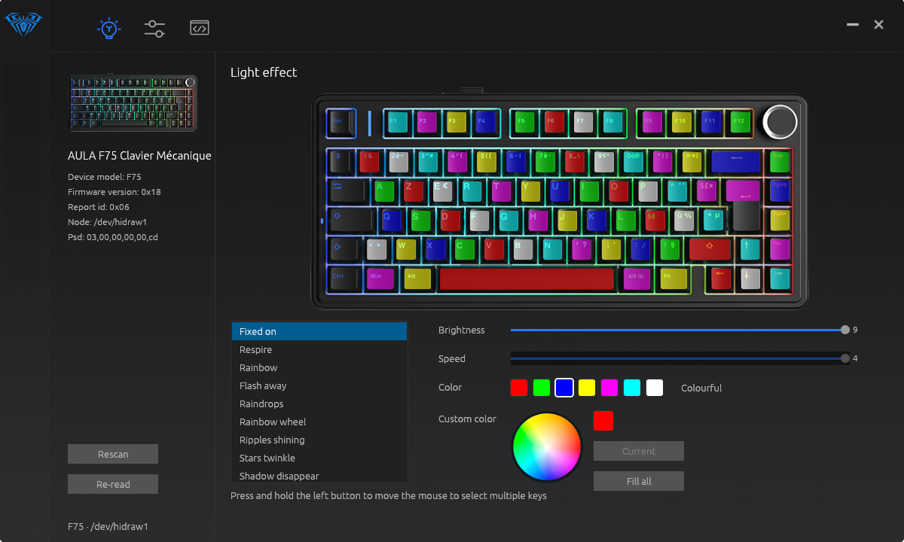

<div align="center">

# aula

**Linux control software for AULA mechanical keyboards.**

AULA ships Windows drivers only. `aula` speaks the same vendor HID protocol and
wears the same skin, so your keyboard is configurable on Linux without a virtual
machine.

[](https://github.com/yhuikzdtguioaert/AulaSofwareLinux/actions/workflows/ci.yml)
[](https://github.com/yhuikzdtguioaert/AulaSofwareLinux/releases/latest)
[](LICENSE)



</div>

---

## Install

One command — downloads the latest release and installs it:

```bash
curl -fsSL https://github.com/yhuikzdtguioaert/AulaSofwareLinux/releases/latest/download/aula-linux-x86_64.tar.gz | tar xz -C ~/.local/share && ~/.local/share/aula/install.sh
```

The script asks for `sudo` once, only to drop a udev rule into
`/etc/udev/rules.d/`. Without that rule `/dev/hidraw*` is root-only and no
userspace program can reach the keyboard. Replug the keyboard afterwards, then:

```bash
~/.local/share/aula/aula
```

<details>
<summary><b>Build from source instead</b></summary>

```bash
git clone https://github.com/yhuikzdtguioaert/AulaSofwareLinux
cd AulaSofwareLinux
cargo build --release
sudo cp udev/60-aula.rules /etc/udev/rules.d/
sudo udevadm control --reload && sudo udevadm trigger
./target/release/aula
```

Needs a Rust toolchain and the usual desktop development headers
(`libxkbcommon`, `libwayland`, `libgl`, `libxcb`). Wayland and X11 both work.

</details>

---

## What it does

| | |
|---|---|
| Finds the keyboard and identifies the model | confirmed on hardware |
| Lighting effect, brightness, speed, colour | confirmed on hardware |
| Sleep timeout | confirmed on hardware |
| Per-key RGB | implemented |
| Debounce | implemented, offset unconfirmed |
| Factory reset | implemented |
| Battery level | implemented, on models that report it |
| Key remapping | transport ready, encoding unconfirmed |
| Macros | transport ready, record format unconfirmed |
| Firmware update | not implemented |

*Confirmed* means verified against a physical keyboard, not merely read out of
the Windows driver.

`aula` never builds a settings page from nothing. It reads the page off the
keyboard, patches only the bytes you changed, and writes it back — so fields it
does not understand survive untouched. It also refuses to write a page missing
the keyboard's own `5A A5` end marker, which is what a failed read looks like.

---

## Supported keyboards

Every keyboard in this family enumerates as USB `258a:010c`, so the USB ids say
nothing about which model is attached. `aula` asks the device for its six-byte
identity string and matches that — exactly as the Windows driver does.

| Model | Identity | Keys | LEDs |
|---|---|---|---|
| F75 | `03 00 00 00 00 cd` | 82 | 90 |
| F87 | `03 00 00 00 00 8f` | 87 | 102 |
| F87 PRO | `03 00 00 00 01 0b` | 87 | 102 |
| F87 PRO Wired | `03 00 00 00 00 a9` | 87 | 102 |
| F99 | `03 00 00 00 00 a4` | 99 | 113 |
| F99 Pro | `03 00 00 00 01 58` | 100 | 113 |
| F99 Wired | `03 00 00 00 00 9a` | 99 | 113 |
| H108 | `03 00 00 00 03 7c` | 108 | 125 |

The F75 is the model everything was verified on. The rest share the same
firmware generation, command channel and command set.

**Not covered:** AULA products built on different silicon — the S98Pro (SONiX
`0c45:800a`), the older Delphi-era tools (F108, F98Pro, S75Pro, SC620, F2088)
and the mice. Those need their own protocol backends. The Hall-effect family
(WIN 60/68 HE) does have one now, for identification — see
[below](#aula-hall-effect-keyboards-win-6068-he).

<details>
<summary><b>Adding a model</b></summary>

No code changes are needed for another keyboard of the same family. Key
positions, LED indices, effect lists and value ranges are all read from the
vendor's own `KB.ini`.

Grab the model's package from
[aulagaming.com](https://www.aulagaming.com/pages/download), unpack it with
`innoextract -e -s -d out MODEL_Setup.exe`, then copy its device description
into place:

```
assets/devices/<model>/device.ini    the package's Dev/kb/*/KB.ini, as UTF-8
assets/devices/<model>/keyimg.png    the keyboard picture beside it
```

`device.ini` is read as-is — `Psd=` identifies the model, `[KEY]` carries the
pixel rectangle, function code and LED index of every key, and `LedOptN=` lists
the hardware effects with the controls each one honours.

Plug in an unknown keyboard of this family and `aula` prints the identity bytes
it read, so you can see immediately what needs adding.

</details>

---

## AULA Hall-effect keyboards (WIN 60/68 HE)

The Hall-effect generation — `WIN 60 HE`, `WIN 68 HE`, and their PRO/MAX/ULTRA
variants — is a different family on different silicon (USB `1ca2:1902`, vendor
usage page `0xFFA0`). It does not speak the BYCOMBO4 protocol, so it is handled
by its own backend (`src/he.rs`).

Supported today are **identification**, **lighting**, **per-key colours** and
**profile switching**:

```bash
~/.local/share/aula/aula he-info      # model, firmware, travel limits
~/.local/share/aula/aula he-light     # read the lighting page
~/.local/share/aula/aula he-light on
~/.local/share/aula/aula he-light mode 1
~/.local/share/aula/aula he-light brightness 4
~/.local/share/aula/aula he-light color 00a0ff
~/.local/share/aula/aula he-profile   # active onboard profile
~/.local/share/aula/aula he-profile 1 # switch to profile 2
~/.local/share/aula/aula he-keys      # the base key matrix
~/.local/share/aula/aula he-rgb       # per-key custom colours
~/.local/share/aula/aula he-rgb fill 00a0ff
```

The window recognises it too. With no mechanical keyboard attached, opening
`aula` falls back to the Hall-effect backend and shows the device details, a
profile selector (four onboard configurations), a lighting page and a
"fill all key colours" control, instead of "Please connect your device.".

Reading the key matrix (`he-keys`) is implemented. Writing a remap is not yet:
the firmware's layout table stores per-key overrides for four Fn layers and a
dozen per-key settings, and the write encoding has not been confirmed on
hardware, so `aula` does not touch it.

```
model      WIN 60 HE PRO
firmware   App V1.1.6
protocol   1.0.9
travel     0.020 mm min, 3.400 mm max, precision 0.020 mm
```

`he-info` sends only the handshake and query frames (`SYNC`, model name,
protocol version, travel limits, polling rate) — nothing that changes a
setting. It finds the keyboard by the shape of its HID report descriptor
(`0xFFA0`/`0x01`, 64-byte input and output reports), so the USB id does not have
to be trusted.

`he-light` reads the lighting page and, given a setting, reads the page first,
patches only that field, writes it back, then reads it back and compares. If
the write does not stick the previous page is restored and the command fails.

Per-key RGB, actuation and rapid trigger are decoded from AULA's own web driver
but not implemented yet. In the meantime AULA's web driver at
<https://win.aulacn.com> works on Linux in Chromium — the udev rule from
`aula udev` covers `1ca2:1902` too.

---

## Command line

The window is the point, but everything is reachable from a terminal too — the
protocol console is how the remaining unknown bytes get pinned down.

```
aula                       open the window
aula devices               list hidraw nodes and the profiles that match
aula info                  identify the attached keyboard
aula he-info               identify an AULA Hall-effect keyboard (WIN 60/68 HE)
aula he-light [setting v]  read or change the Hall-effect keyboard's lighting
aula he-profile [0-3]      show or switch the active onboard profile
aula he-keys               dump the Hall-effect key matrix
aula he-rgb [fill RRGGBB]  read or fill the per-key colours
aula dump [len]            read the settings page and print it
aula read <cmd> <param> <len>
                           raw read from the command channel
aula poke <offset> <value> write one byte of the settings page
aula reset                 restore the factory configuration
aula udev                  print a udev rule covering every known model
```

---

## How it works

Plain HID feature reports on a vendor usage page — no kernel module, no libusb,
just `/dev/hidrawN` and two ioctls.

```
byte 0      HID report id      6 on current firmware
byte 1      command            high bit set = read
byte 2      parameter          layer index or sub-selector
byte 3      0
byte 4      total packages     ceil(len / 512)
byte 5      package index
byte 6..7   payload length     little endian, <= 512
byte 8..    payload            zero padded to a 520-byte report
```

The right hidraw node is the one whose report descriptor declares a 519-byte
feature report, which is more robust than guessing interface numbers.

| Command | Meaning |
|---|---|
| `0x03` / `0x83` | key matrix for one layer |
| `0x04` / `0x84` | lighting and settings page |
| `0x05` / `0x85` | macro storage |
| `0x06` / `0x86` | game mode table |
| `0x0a` / `0x8a` | per-key RGB, 3 bytes per LED |
| `0x11` | factory reset |
| `0x82` | identity — parameter 1 returns the model string |
| `0x87` | battery |

Brightness, speed and colour are stored *per effect*: the keyboard keeps a
separate set for each lighting mode and recalls it when you switch. That table
lives at offset `0x3a` of the settings page, two bytes per slot, indexed by the
effect's position in the list.

That indexing was settled on hardware rather than guessed. `Fn+Tab` cycles the
colour of the live effect, and pressing it moved exactly one byte in the whole
page — `0x3b`, from `40` to `41`, as the keyboard went red to green. One press
pinned down both the slot indexing and the colour numbering.

The full protocol is documented in the doc comments of
[`src/proto.rs`](src/proto.rs) and
[`src/config_page.rs`](src/config_page.rs).

---

## Repository layout

```
src/ini.rs           vendor INI reader (UTF-16 / UTF-8 / GBK)
src/profile.rs       KB.ini -> device description
src/hid.rs           hidraw transport and report-descriptor parsing
src/he.rs            the Hall-effect family (WIN 60/68 HE), identification
src/proto.rs         the vendor frame format and command set
src/device.rs        discovery and model identification
src/config_page.rs   the settings page, read-modify-write
src/worker.rs        background HID thread
src/ui/              the window, drawn with the vendor's own bitmaps
assets/              device descriptions, artwork and strings
udev/                the access rule
```

---

## Legal

**Not affiliated with AULA.** This is an independent, unofficial project. AULA
and the AULA logo are trademarks of their respective owner, used here only to
say which hardware this software talks to. The project is not endorsed by,
sponsored by, or connected to AULA in any way.

**Why it exists.** AULA publishes configuration software for Windows only. This
program was written so the same keyboards can be configured on Linux by the
people who bought them. The communication protocol was determined by observing
how the hardware behaves and by studying the vendor's own driver, for the sole
purpose of interoperability — a purpose expressly permitted for computer
programs by, among others, Article 6 of EU Directive 2009/24/EC and the
interoperability exemption in 17 U.S.C. § 1201(f).

**Third-party material.** `assets/` contains artwork, device descriptions and
interface strings taken from AULA's own Windows driver package. Copyright in
those files belongs to AULA, not to this project, and they are included solely
so the software can identify the hardware and present the interface its owner
already knows. No claim of ownership is made over them. If the rights holder
objects, open an issue or contact the repository owner and the material will be
removed promptly; the program can instead extract it from the installer on each
user's own machine.

**No warranty.** The software is provided "as is", without warranty of any kind.
It writes to your keyboard's configuration memory. It has been tested on the
hardware listed above and takes care to preserve settings it does not
understand, but no one behind this project accepts liability for any damage,
data loss, or a device left in an unexpected state. Every keyboard here also has
a hardware factory reset (`Fn+Esc`, held).

**Use at your own risk, on hardware you own.**

## Licence

The source code in this repository is MIT licensed — see [LICENSE](LICENSE).
The licence covers the code only, not the third-party material described above.
